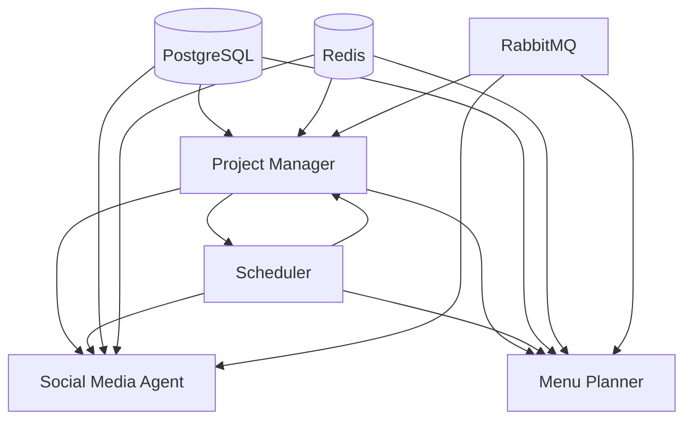

# 🤖 AI Agent System for Mocha's MindLab

Autonomous AI agents that handle marketing, content generation, and meal planning operations with minimal human intervention.

## 📋 Overview

This agent system consists of four main components working together:

1. **Project Manager Agent** - Orchestrates and monitors all agents
2. **Social Media & SEO Agent** - Handles marketing automation
3. **Menu Planning Agent** - Generates monthly meal calendars
4. **Scheduler** - Manages automated tasks and timing

## 🏗️ Architecture



## 🚀 Quick Start

### Prerequisites

- Docker and Docker Compose
- API Keys (see `.env.example`)
- 8GB+ RAM recommended
- 20GB+ disk space

### Setup

1. **Configure environment**
```bash
cp .env.example .env
# Edit .env with your API keys
```

2. **Start the system**
```bash
docker-compose up -d
```

3. **Check status**
```bash
docker-compose ps
docker-compose logs -f
```

4. **Access dashboards**
- Grafana: http://localhost:3001 (admin/admin)
- RabbitMQ: http://localhost:15672 (admin/admin)
- Agent UI: http://localhost:3002

## 🎯 Agent Capabilities

### Project Manager Agent
- **Purpose**: Central coordination and monitoring
- **Tasks**:
  - Health checks every 5 minutes
  - Error recovery and retry logic
  - Task distribution and load balancing
  - Daily reports generation
  - Alert management
- **Schedule**: Always running

### Social Media & SEO Agent
- **Purpose**: Automated marketing and content optimization
- **Tasks**:
  - Post to Twitter/Instagram/Facebook
  - Generate blog content
  - SEO keyword research
  - Competitor analysis
  - Engagement tracking
- **Schedule**: Runs every 4 hours

### Menu Planning Agent
- **Purpose**: Generate and manage meal calendars
- **Tasks**:
  - Create monthly meal calendars
  - Calculate nutritional information
  - Generate shopping lists
  - Optimize recipes for seasonality
  - Update based on user feedback
- **Schedule**: Daily at 2 AM, full generation on 25th

### Scheduler
- **Purpose**: Cron-like task scheduling
- **Tasks**:
  - Trigger scheduled agent tasks
  - Manage time-based workflows
  - Handle recurring operations
- **Schedule**: Always running

## 📊 Monitoring

### Health Checks

```bash
# Check all agent health
curl http://localhost:8000/health

# Individual agent status
curl http://localhost:8001/status  # Project Manager
curl http://localhost:8002/status  # Social Media
curl http://localhost:8003/status  # Menu Planner
```

### Metrics

Prometheus metrics available at:
- http://localhost:9090/metrics

Key metrics to monitor:
- `agent_tasks_completed`
- `agent_errors_total`
- `agent_response_time`
- `queue_size`

### Logs

```bash
# All logs
docker-compose logs -f

# Specific agent
docker-compose logs -f project-manager
docker-compose logs -f social-seo-agent
docker-compose logs -f menu-planner
```

## 🔧 Configuration

### Task Schedules

Edit `scheduler/crontab`:
```cron
# Generate calendars on 25th of each month
0 2 25 * * /app/scripts/generate_calendar.py

# Social media posts 3x daily
0 9,13,18 * * * /app/scripts/social_post.py

# SEO analysis weekly
0 3 * * 1 /app/scripts/seo_analysis.py
```

### Agent Configuration

Each agent has its own config in `{agent}/config.yaml`:
```yaml
agent:
  name: "project-manager"
  version: "1.0.0"

tasks:
  health_check:
    interval: 300  # seconds
    timeout: 30

  daily_report:
    schedule: "0 9 * * *"
    recipients:
      - "admin@mochasmindlab.com"
```

## 🛠️ Development

### Running Locally

```bash
# Start dependencies only
docker-compose up -d postgres redis rabbitmq

# Run agent locally
cd project-manager
pip install -r requirements.txt
python -m src.main
```

### Testing

```bash
# Run unit tests
cd agents
pytest tests/

# Integration tests
docker-compose -f docker-compose.test.yml up
```

### Adding New Agents

1. Create agent directory:
```bash
mkdir new-agent
cd new-agent
```

2. Add Dockerfile:
```dockerfile
FROM python:3.11-slim
WORKDIR /app
COPY requirements.txt .
RUN pip install -r requirements.txt
COPY . .
CMD ["python", "-m", "src.main"]
```

3. Update docker-compose.yml
4. Implement agent logic
5. Test and deploy

## 📝 API Documentation

### Project Manager API

**GET /health**
```json
{
  "status": "healthy",
  "uptime": 3600,
  "agents": {
    "social-media": "online",
    "menu-planner": "online"
  }
}
```

**POST /task**
```json
{
  "type": "generate_calendar",
  "params": {
    "month": "2025-10",
    "diet_type": "mediterranean"
  }
}
```

### Menu Planner API

**POST /generate**
```json
{
  "month": "2025-10",
  "diet_preferences": ["vegetarian"],
  "servings": 4
}
```

**GET /calendar/{month}**
```json
{
  "month": "2025-10",
  "days": [...]
}
```

## 🚢 Deployment

### Production Deployment

1. **AWS ECS**
```bash
# Build and push images
./scripts/build-and-push.sh

# Deploy to ECS
aws ecs update-service --cluster production --service agents
```

2. **Kubernetes**
```bash
# Apply manifests
kubectl apply -f k8s/

# Check status
kubectl get pods -n agents
```

3. **Docker Swarm**
```bash
# Deploy stack
docker stack deploy -c docker-compose.yml agents
```

## 🐛 Troubleshooting

### Common Issues

| Issue | Solution |
|-------|----------|
| Agent not starting | Check logs: `docker logs <container>` |
| High memory usage | Increase Docker memory limit |
| Queue overflow | Scale workers: `docker-compose scale menu-planner=3` |
| API timeouts | Check network connectivity |
| Database connection | Verify DATABASE_URL |

### Debug Mode

```bash
# Enable debug logging
export DEBUG=true
docker-compose up
```

### Recovery Procedures

```bash
# Reset failed agent
docker-compose restart project-manager

# Clear task queue
docker exec mindlab-redis redis-cli FLUSHDB

# Restore from backup
./scripts/restore-backup.sh
```

## 📈 Performance

### Resource Requirements

| Agent | CPU | Memory | Disk |
|-------|-----|--------|------|
| Project Manager | 0.5 | 512MB | 1GB |
| Social Media | 1.0 | 1GB | 2GB |
| Menu Planner | 2.0 | 2GB | 5GB |
| PostgreSQL | 1.0 | 2GB | 20GB |
| Redis | 0.5 | 512MB | 1GB |

### Scaling

```yaml
# docker-compose.override.yml
services:
  menu-planner:
    deploy:
      replicas: 3

  social-seo-agent:
    deploy:
      replicas: 2
```

## 🔒 Security

### Best Practices

1. **Never commit `.env` files**
2. **Use secrets management in production**
3. **Rotate API keys monthly**
4. **Enable TLS for RabbitMQ**
5. **Use read-only database users where possible**

### Backup Strategy

```bash
# Daily database backup
0 3 * * * /scripts/backup-db.sh

# Weekly full system backup
0 4 * * 0 /scripts/full-backup.sh
```

## 📚 Additional Resources

- [Agent Development Guide](./docs/development.md)
- [API Reference](./docs/api.md)
- [Deployment Guide](./docs/deployment.md)
- [Monitoring Setup](./docs/monitoring.md)

## 📞 Support

- **Internal Docs**: `/agents/docs`
- **Logs**: `/var/log/agents`
- **Slack**: #agents-support
- **Email**: agents@mochasmindlab.com

---

**Maintained by Mocha's MindLab DevOps Team**